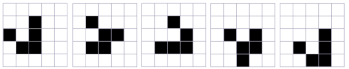

# Game of Life

The Game of Life is a cellular automaton devised by the mathematician John Horton Conway in 1970. It is a zero-player game, meaning that its evolution is determined by its initial state, requiring no further input. The game consists of an infinite two-dimensional orthogonal grid of square cells, each of which is in one of two possible states, alive or dead.

## Usage

The `GameOfLife` class provides an implementation of the Game of Life. To use it, create a new instance of `GameOfLife` with the desired width and height of the universe:

```java
GameOfLife game = new GameOfLife(25, 25);
```

Then, initialize the universe with a pattern of live and dead cells:

```java
boolean[][] pattern = {
        {false, false, true, false, false},
        {true, false, true, false, false},
        {false, true, true, false, false},
        {false, false, false, false, false},
        {false, false, false, false, false}
};
game.initialize(pattern);
```

The `initialize` method places the pattern at the center of the universe.

To update the state of the universe according to the rules of the Game of Life, call the `update` method:

```java
game.update();
```

To print the current state of the universe to the console, call the `printState` method:

```java
game.printState();
```

## Rules

The rules of the Game of Life are as follows:

1. Any live cell with fewer than two live neighbors dies as if caused by underpopulation.
2. Any live cell with two or three live neighbors lives on to the next generation.
3. Any live cell with more than three live neighbors dies, as if by overcrowding.
4. Any dead cell with exactly three live neighbors becomes a live cell, as if by reproduction.

## Example

The following example initializes the game with a 25x25 universe and the Glider pattern, and prints the state of the universe for 20 generations:

```java
GameOfLife game = new GameOfLife(25, 25);

boolean[][] pattern = {
        {false, false, true, false, false},
        {true, false, true, false, false},
        {false, true, true, false, false},
        {false, false, false, false, false},
        {false, false, false, false, false}
};
game.initialize(pattern);

for (int i = 0; i < 20; i++) {
    game.update();
    game.printState();
    System.out.println();
}
```

Subsequent stages of the glider pattern on Conway's Game of Life cellular automaton grid.  
